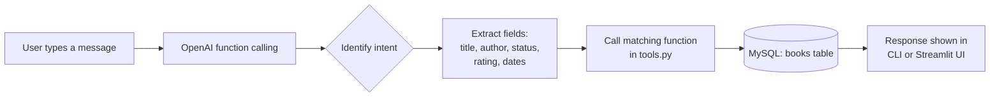

# My Bookshelf — AI-Powered Reading Tracker

A personal reading tracker you talk to in plain English. Built as a tool-calling
project: an LLM (via the OpenAI Responses API) decides which Python function to
call — add a book, update its status, rate it, delete it, or summarize your
reading — based on what you type.

Two interfaces share the same backend:
- **`main.py`** — a terminal chat loop
- **`bookshelf_ui.py`** — a Streamlit app with a visual bookshelf illustration,
  a month filter, and the same chat assistant in a side panel

## Features

- Add a book by title/author, with optional genre and target month
- Mark a book as **Currently Reading**, **On Hold**, or **Completed** using
  natural language ("I started Dune", "I finished 1984, 5 stars")
- Delete a book by id, or by title/author if you don't know the id — the
  assistant looks it up first and asks for clarification if more than one
  book matches
- Rate and review books once completed
- Get a reading summary: book count and average rating per status
- (Streamlit only) A illustrated shelf view grouped by status, filterable by
  the month you targeted for each book

## Tech stack

- Python 3.13
- MySQL (via SQLAlchemy + PyMySQL)
- OpenAI Responses API (function calling / tool use)
- Streamlit (UI)
- Pandas (query results)

## Project structure

```
.
├── tools.py       # DB functions: add_book, get_books, update_book, delete_book, get_reading_summary
├── my_tools.py    # JSON schemas describing each tool to the LLM
├── main.py        # Terminal chat loop
├── bookshelf_ui.py# Streamlit UI (illustrated shelf + chat panel)
├── books.sql      # CREATE TABLE + seed data
└── req.txt        # Python dependencies
```

## Setup

### 1. Install dependencies

```bash
python -m venv myenv
source myenv/bin/activate        # Windows: myenv\Scripts\activate
pip install -r req.txt
```

### 2. Set up the database

Create a MySQL database (this project assumes a database named `analytics`),
then run the schema and seed data:

```bash
mysql -u root -p analytics < books.sql
```

Update the connection string in `tools.py` if your username, password, host,
or database name differ:

```python
engine = create_engine(
    "mysql+pymysql://root:<your-password>@localhost:3306/analytics"
)
```

### 3. Add your OpenAI API key

Create a `.env` file in the project root:

```
OPENAI_API_KEY=sk-...
```

Optionally set a specific model (defaults to `gpt-5.6-sol` if unset):

```
OPENAI_MODEL=gpt-5.6-sol
```

## Running it

**Terminal chat:**
```bash
python main.py
```
Type `exit` or `quit` to end the session.

**Streamlit UI:**
```bash
streamlit run bookshelf_ui.py
```

## Example things to say

- "Add Dune by Frank Herbert, genre sci-fi"
- "I started reading Dune"
- "I finished 1984, give it 5 stars"
- "Put The Alchemist on hold"
- "Show me everything by Andy Weir"
- "What's on my currently-reading list?"
- "Delete the book by Bram Stoker"
- "Give me a summary of my reading"

## How it works



1. Your message is sent to the LLM along with the tool schemas in `my_tools.py`.
2. If the LLM decides a tool is needed, it returns a function call (name +
   arguments) instead of a text reply.
3. The app looks up the matching Python function in `tool_mapping`, runs it
   against the database, and sends the result back to the LLM.
4. The LLM uses that result to either call another tool (e.g. look up a book
   by title, then update it) or reply in plain language.

`SYSTEM_INSTRUCTIONS` tells the model to always look up a book by title before
updating or deleting it when an id isn't given, and to ask for clarification
if more than one book matches.

## Known limitations

- Queries are built with f-strings, not parameterized SQL — fine for local,
  single-user use, but not safe for untrusted input in a production setting
- No unit conversion or duplicate-title handling — two books with the same
  title/author will confuse "delete by title" lookups
- The Streamlit UI's cover/shelf illustration is generated art, not real book
  cover images
